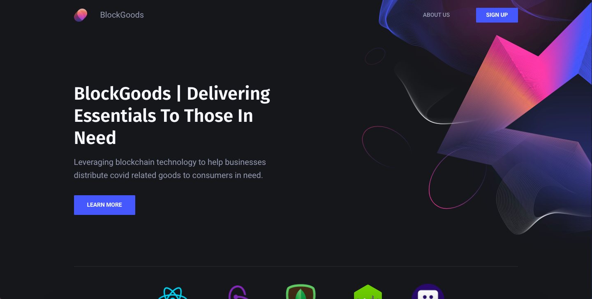
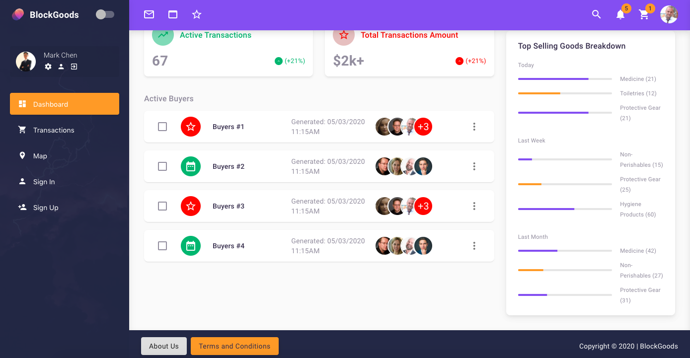
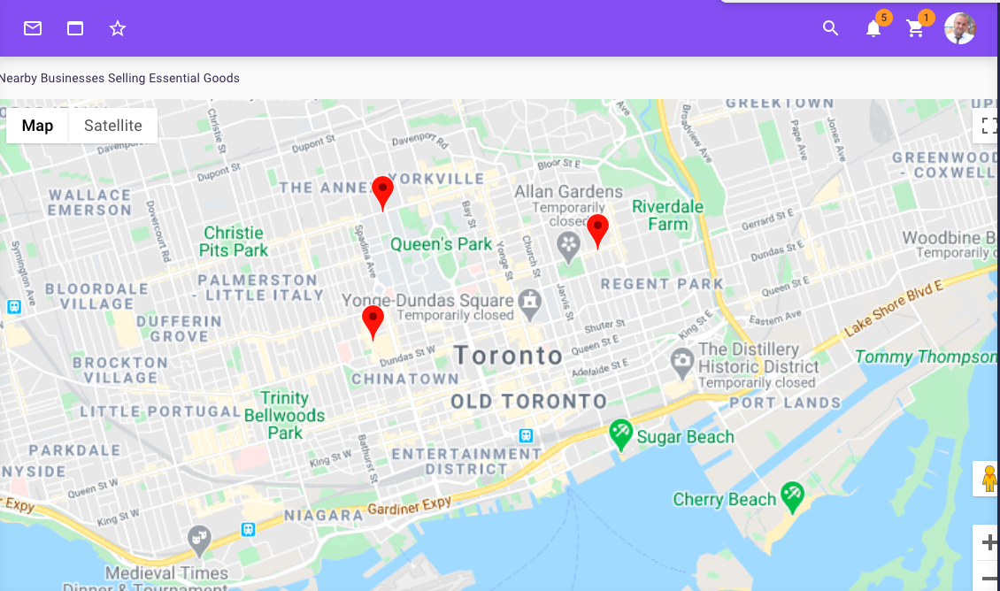
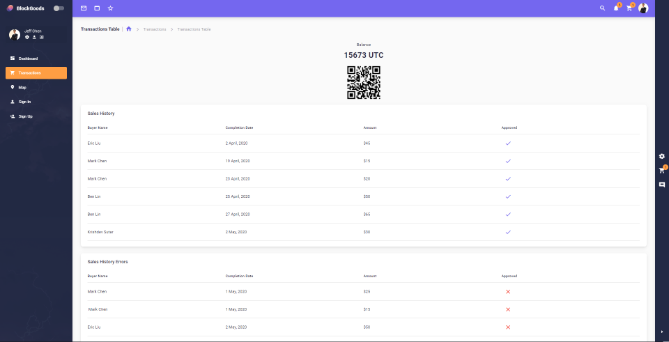

# TOHacks 2020

## Inspiration
**BlockGoods** is an app designed to help redistribute essential goods to the people who need it most in the midst of the COVID-19 pandemic. We were inspired by the shortage of masks and other essential supplies for frontline workers during this time. An increase in demand of essential supplies like hand sanitizer, soap, face masks, medicine, and toilet paper have caused many of these items to be either heavily inflated in price or sold out in stores. Due to this increase of demand, many frontline workers and people at risk are unable to get access to the supplies that they so crucially need to stay safe and sustain themselves. Prices of masks and other essential goods have risen dramatically, with some firms selling respirator masks for as much as 6 times the price of what 3M, the manufacturer, sells them for. Business Insider states that mask producers are struggling to produce 20 times more surgical and N95 masks to keep up with the increased demand. According to CTV, a shortage of N95 masks has caused Sunnybrook Health Sciences Centre in Toronto to consider using snorkeling masks as an alternative. Moreover, countless doctors and healthcare workers are risking their lives due to the dangerous shortage of protective equipment, as Hamilton Health Sciences sent out a notice to workers to “keep masks on until grossly soiled”. BlockGood’s goal was to develop an easy, quick, and efficient to use platform to facilitate the distribution of these supplies directly to the people who need it most, with the inclusion of government incentives using blockchain technology. With the help and support from governments and businesses, our platform **BlockGoods** can save lots of lives during the current pandemic crisis, while easing the burdens on local institutions and hospitals.

## What it does
Through the use of **BlockGoods**, a government or any kind of state can create a new cryptocurrency in the form of a debt security which is used to support the state’s spendings and obligations. The currency will then be distributed reasonably amongst the people at the beginning of each month to regulate supply and demand, allowing everyone to have equal access to these essential materials. People can use these coins through the platform to buy essential goods from sellers in their community, whether it be from the producers themselves or retail stores. Once the pandemic is over, these coins can then be exchanged between sellers and the government for monetary value. 

## How We built it
Using the Blockstack decentralized app service, a permanent storage system was created for transactions and listing information. This lifted the burden of having a large centralized server. With React, Material-UI, SCSS, and BootStrap, a UI was developed to display the information from the servers onto the user dashboards in a clean and efficient manner. A clean and crisp landing page showcasing **BlockGoods'** mission statement was also prototyped and built quickly thanks to Material-UI’s ease of use. On the backend, Redux was used in conjunction with Mongoose, Express.js and Node.js to save critical information such as usernames, passwords, transactions, and payments to our app. For user authentication, JWT, Firebase, and the BlockStack API were used to let users sign in and out of the app securely. To use our platform, each user has to individually obtain a Blockstack ID in order to login and benefit from all of **BlockGoods’** features. Finally, for cloud deployment we decided to use Google Cloud as it quickly enabled us to host our app up in no time at all (the $50 Google Cloud credits also came in very handy).

## Who It Is For
Our app can be easily integrated in places all around the world to flatten the curve and put an end to this concerning pandemic. Whether it’s average consumers or local businesses and even large companies/organizations, our app is there to provide a more socially-distant experience when purchasing essentials like medicine, toiletries, hygienic products, and so on. During these uncertain times, our application provides an easy to use platform for governments working alongside with its people to combat COVID-19. **Blockgoods’** users can rest assured that they can distribute and/or obtain high-demand goods at very affordable prices -- all from the comfort of their homes and without having to sacrifice their own personal well-being. We encourage all governments to consider implementing this and using our app in order to achieve a global effect!

## Challenges we ran into
1. The lack of documentation when attempting to use Blockstack in React meant that our members had to spend some time learning how to best use Blockstack in this project. Prior to this hackathon, only one member of our team had previous experience working with Blockstack.
2. Not communicating face to face with each other meant that we had to rely on Discord channels and Direct Messaging to maintain critical communications during the whole duration of this hackathon.

## Accomplishments that We're proud of
We are proud of the amount of work we put into this project. Despite it being a daunting task, we were able to finish the programming, video editing, other tasks on time. We were able to work efficiently due to the combined efforts of everyone despite not being physically present together.

## What We learned
We were able to grasp a better understanding of React Js while working on this project. This project was indeed challenging, however, this forced us to learn the BlockStack API in more depth. Finally, we learned that regardless of the hurdles, we are able to accomplish anything if we put our minds to it.

=======
## Inspiration
**BlockGoods** is an app designed to help redistribute essential goods to the people who need it most in the midst of the COVID-19 pandemic. We were inspired by the shortage of masks and other essential supplies for frontline workers during this time. An increase in demand of essential supplies like hand sanitizer, soap, face masks, medicine, and toilet paper have caused many of these items to be either heavily inflated in price or sold out in stores. Due to this increase of demand, many frontline workers and people at risk are unable to get access to the supplies that they so crucially need to stay safe and sustain themselves. Prices of masks and other essential goods have risen dramatically, with some firms selling respirator masks for as much as 6 times the price of what 3M, the manufacturer, sells them for. Business Insider states that mask producers are struggling to produce 20 times more surgical and N95 masks to keep up with the increased demand. According to CTV, a shortage of N95 masks has caused Sunnybrook Health Sciences Centre in Toronto to consider using snorkeling masks as an alternative. Moreover, countless doctors and healthcare workers are risking their lives due to the dangerous shortage of protective equipment, as Hamilton Health Sciences sent out a notice to workers to “keep masks on until grossly soiled”. BlockGood’s goal was to develop an easy, quick, and efficient to use platform to facilitate the distribution of these supplies directly to the people who need it most, with the inclusion of government incentives using blockchain technology. With the help and support from governments and businesses, our platform **BlockGoods** can save lots of lives during the current pandemic crisis, while easing the burdens on local institutions and hospitals.

## What it does
Through the use of **BlockGoods**, a government or any kind of state can create a new cryptocurrency in the form of a debt security which is used to support the state’s spendings and obligations. The currency will then be distributed reasonably amongst the people at the beginning of each month to regulate supply and demand, allowing everyone to have equal access to these essential materials. People can use these coins through the platform to buy essential goods from sellers in their community, whether it be from the producers themselves or retail stores. Once the pandemic is over, these coins can then be exchanged between sellers and the government for monetary value. 

## How We built it
Using the Blockstack decentralized app service, a permanent storage system was created for transactions and listing information. This lifted the burden of having a large centralized server. With React, Material-UI, SCSS, and BootStrap, a UI was developed to display the information from the servers onto the user dashboards in a clean and efficient manner. A clean and crisp landing page showcasing **BlockGoods'** mission statement was also prototyped and built quickly thanks to Material-UI’s ease of use. On the backend, Redux was used in conjunction with Mongoose, Express.js and Node.js to save critical information such as usernames, passwords, transactions, and payments to our app. For user authentication, JWT, Firebase, and the BlockStack API were used to let users sign in and out of the app securely. To use our platform, each user has to individually obtain a Blockstack ID in order to login and benefit from all of **BlockGoods’** features. Finally, for cloud deployment we decided to use Google Cloud as it quickly enabled us to host our app up in no time at all (the $50 Google Cloud credits also came in very handy).

## Who It Is For
Our app can be easily integrated in places all around the world to flatten the curve and put an end to this concerning pandemic. Whether it’s average consumers or local businesses and even large companies/organizations, our app is there to provide a more socially-distant experience when purchasing essentials like medicine, toiletries, hygienic products, and so on. During these uncertain times, our application provides an easy to use platform for governments working alongside with its people to combat COVID-19. **Blockgoods’** users can rest assured that they can distribute and/or obtain high-demand goods at very affordable prices -- all from the comfort of their homes and without having to sacrifice their own personal well-being. We encourage all governments to consider implementing this and using our app in order to achieve a global effect!

## Challenges we ran into
1. The lack of documentation when attempting to use Blockstack in React meant that our members had to spend some time learning how to best use Blockstack in this project. Prior to this hackathon, only one member of our team had previous experience working with Blockstack.
2. Not communicating face to face with each other meant that we had to rely on Discord channels and Direct Messaging to maintain critical communications during the whole duration of this hackathon.

## Accomplishments that We're proud of
We are proud of the amount of work we put into this project. Despite it being a daunting task, we were able to finish the programming, video editing, other tasks on time. We were able to work efficiently due to the combined efforts of everyone despite not being physically present together.

## What We learned
We were able to grasp a better understanding of React Js while working on this project. This project was indeed challenging, however, this forced us to learn the BlockStack API in more depth. Finally, we learned that regardless of the hurdles, we are able to accomplish anything if we put our minds to it.

## What's next for BlockGoods
**BlockGoods** can be continued to be deployed in communities all across the world. We can continue to add support for different languages and work with local governments and companies/large organizations to introduce **BlockGoods** to these different communities. Due to the nature of our app, we can easily scale our platform to allow transactions of goods beyond just the essentials. Due to the unprecedented and uncertain time that we are living in, we are only focusing on goods that have proved to be critical during quarantine and lockdown. **BlockGoods** aims to not only be of great use during the pandemic but also after it is over by relying on the decentralized applications of blockchain to gain the support of users all around the world. As such, post COVID-19, **BlockGoods** can be continued to be used as a trading platform for people willing to donate their unwanted materials for the greater good of humanity.
